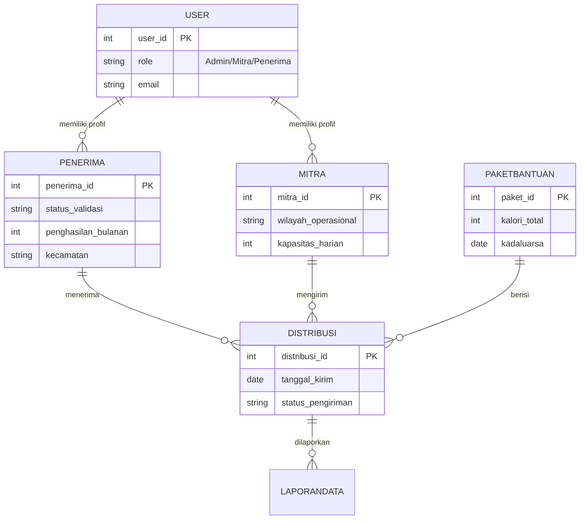

# 🍱 MBG (Makan Bergizi Gratis) Logistics Database


> **Sistem manajemen basis data relasional untuk mendukung rantai pasok (supply chain) Program Makan Bergizi Gratis Nasional.**

---

## 🏛️ Project Overview

Proyek ini merancang arsitektur backend database untuk mengelola logistik program bantuan pangan skala besar. Tantangan utama dalam sistem ini adalah memastikan **integritas data** antara:
1.  **Penerima Manfaat:** Validasi data siswa/masyarakat rentan.
2.  **Mitra Penyedia:** Manajemen dapur umum dan jasa katering.
3.  **Distribusi:** Pelacakan paket bantuan secara real-time.

Skema database dirancang mengikuti standar **3rd Normal Form (3NF)** untuk meminimalkan redundansi dan menjaga akurasi pelaporan gizi.

---

## 📐 Entity Relationship Diagram (ERD)

Diagram di bawah ini menggambarkan arsitektur relasi antar tabel. Sistem menggunakan pendekatan terpusat di tabel `USER` untuk autentikasi, yang bercabang ke profil `MITRA` dan `PENERIMA`.


⚙️ Key Architectural Decisions
1. Centralized Authentication (RBAC)
Menggunakan tabel USER sebagai entitas induk (Parent).

Role-Based Access Control: Kolom role memisahkan hak akses logic.

Scalability: Memisahkan data login (email, password) dari data profil spesifik (kapasitas_harian, penghasilan), memungkinkan penambahan tipe user baru di masa depan tanpa merusak struktur tabel utama.

2. Supply Chain Tracking (Fact Table)
Tabel DISTRIBUSI bertindak sebagai tabel transaksi pusat yang merekam:

Source: Siapa yang mengirim (mitra_id).

Destination: Siapa yang menerima (penerima_id).

Item: Apa isinya (paket_id).

Status: Posisi paket saat ini (status_pengiriman).

3. Data Integrity & Validation
Foreign Keys: Semua relasi dijaga ketat dengan Referential Integrity untuk mencegah orphan records (data sampah yang tidak memiliki induk).

Audit Trail: Tabel LAPORANDATA disiapkan terpisah dari tabel transaksi untuk menampung log masalah/keluhan, menjaga tabel DISTRIBUSI tetap ramping dan cepat diakses.

🚀 How to Import
Option 1: Command Line (CLI)
```Bash

# Login ke MySQL
mysql -u root -p
```

```# Buat Database
CREATE DATABASE db_mbg;
USE db_mbg;
```
```# Import Schema
SOURCE /path/to/db_mbg.sql;
```
Option 2: GUI (DBeaver / Workbench)

1. Buka aplikasi SQL Client Anda.

2. Buat koneksi baru ke database local.

3. Klik kanan pada database -> Execute SQL Script -> Pilih db_mbg.sql.

📊 Sample Analytics
Cuplikan query dari queries.sql untuk memantau performa mitra:
SELECT 
    m.nama_mitra,
    m.wilayah_operasional,
    COUNT(d.distribusi_id) as total_paket_terkirim,
    SUM(p.kalori_total) as total_kalori_disalurkan
FROM MITRA m
JOIN DISTRIBUSI d ON m.mitra_id = d.mitra_id
JOIN PAKETBANTUAN p ON d.paket_id = p.paket_id
WHERE d.status_pengiriman = 'Diterima'
GROUP BY m.mitra_id;
